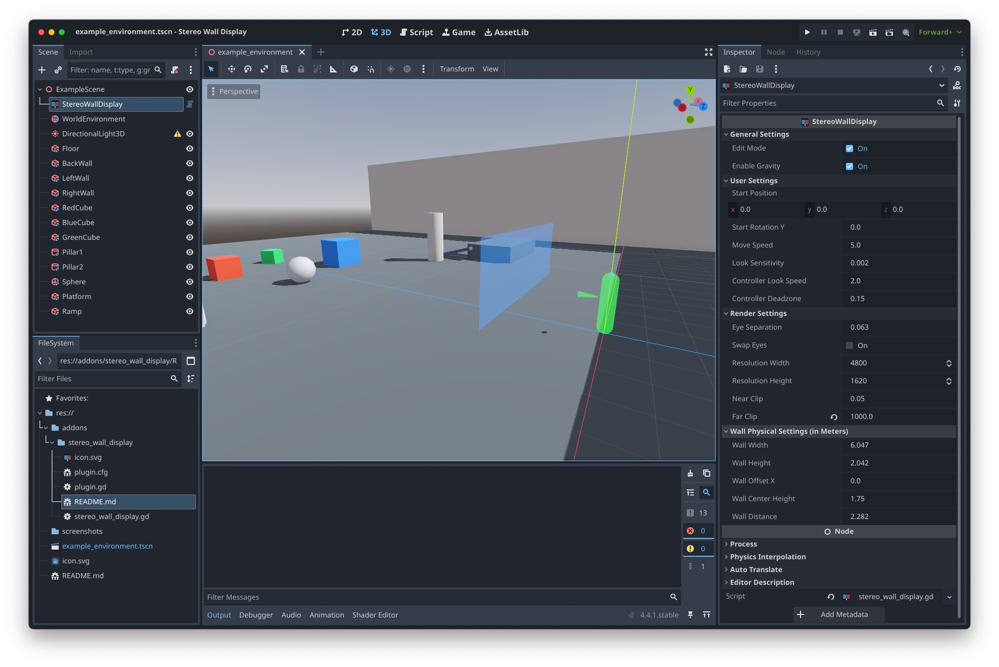

# Stereo Wall Display

A Godot 4.x addon for stereoscopic 3D rendering on large display walls with off-axis projection.




## Features

- Off-axis (asymmetric) frustum projection for accurate perspective
- Side-by-side stereoscopic output for passive 3D displays
- CAVE-style camera rig with fixed wall and movable head
- Built-in fly controls (WASD/mouse/controller)
- Head tracking support (Vive Tracker, VRPN) — coming soon
- Edit mode for development with standard resolution
- Production mode with automatic borderless fullscreen
- Editor visualization of view frustum

## Installation

### From GitHub

1. Download or clone this repository
2. Copy `addons/stereo_wall_display/` into your project's `addons/` folder
3. Enable the plugin: Project > Project Settings > Plugins > Stereo Wall Display

### From Godot Asset Library

1. Open AssetLib in Godot
2. Search for "Stereo Wall Display"
3. Download and install
4. Enable the plugin in Project Settings

## Quick Start

1. Add a `StereoWallDisplay` node to your scene
2. Configure wall dimensions to match your physical display
3. Set `edit_mode = true` during development
4. Set `edit_mode = false` for deployment

### How It Works

The `StereoWallDisplay` is a self-contained camera rig:

```
StereoWallDisplay (Node3D)
│
├── Wall (fixed at wall_distance in -Z direction)
│
└── Head (at origin, Y = static_head_height)
	└── Left/Right eye cameras with off-axis projection
```

- **Fly controls** move the entire rig through your scene
- **Head tracking** moves only the head within the rig, creating parallax

## Configuration

### General Settings

- `edit_mode` — Toggle between development (single camera) and stereo output

### Head Tracking

- `tracking_type` — Select tracking method:
  - **None** — Static head position (shows `static_head_height`)
  - **Vive Tracker** — Track via SteamVR/OpenXR (coming soon)
  - **VRPN** — Track via VRPN server (coming soon)
- `static_head_height` — Eye height when not tracking (default: 1.64m)

### Fly Controls

- `enable_fly_controls` — Enable WASD/mouse/controller movement
- `move_speed` — Movement speed in meters per second
- `look_sensitivity` — Mouse look sensitivity
- `controller_look_speed` — Gamepad right stick sensitivity
- `controller_deadzone` — Stick deadzone

### Render Settings

- `eye_separation` — Inter-ocular distance in meters (default: 0.063m / 63mm)
- `swap_eyes` — Swap left and right eye output
- `resolution_width` / `resolution_height` — Resolution per eye (default: 4800x1620)
- `near_clip` / `far_clip` — Camera clipping planes

### Wall Physical Settings

Configure these to match your physical display wall:

- `wall_width` / `wall_height` — Physical dimensions in meters
- `wall_distance` — Distance from origin to wall
- `wall_center_height` — Height of wall center from ground

## Controls

| Input | Action |
|-------|--------|
| WASD / Left Stick | Move rig |
| Mouse / Right Stick | Look around |
| R | Reset position |
| ESC | Quit application |

## Production Deployment

When `edit_mode` is disabled:

- Window automatically sets to borderless mode
- Window positions at (0, 0)
- Resolution sets to full stereo output (resolution_width × 2 × resolution_height)

## Example

See `addons/stereo_wall_display/example_scene/` for a demo scene.

## Tracking API

For custom tracking integration:

```gdscript
var stereo_display = $StereoWallDisplay

# Set head position from your tracking system
stereo_display.set_head_position(Vector3(x, y, z))

# Get current head position
var pos = stereo_display.get_head_position()

# Reset to static position
stereo_display.reset_head_position()

# Check tracking status
if stereo_display.is_tracking():
	print(stereo_display.get_tracking_status())
```

## References

Based on Robert Kooima's [Generalized Perspective Projection](http://csc.lsu.edu/~kooima/pdfs/gen-perspective.pdf) technique for CAVE and fish-tank VR displays.

## License

MIT License

Copyright (c) 2026 Laboratory for Advanced Visualizations and Applications (LAVA), University of Hawaii.

See [LICENSE](LICENSE) file for details.
