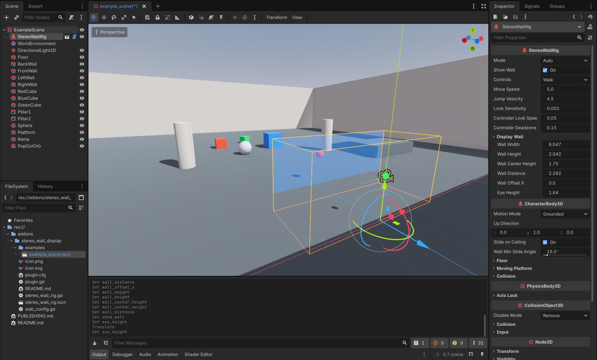

# Stereo Wall Display

A Godot 4.7+ addon for making apps that run on a large 3D display wall, built at the UH LAVA lab. It renders side-by-side stereo with off-axis projection, so 3D content appears correctly to a viewer standing in front of the display wall.

## Download

Get the latest zip from the [Releases page](https://github.com/uhmlavalab/stereo-wall-godot/releases/latest). To add it to a Godot project:

- **In Godot:** open the **AssetLib** tab, click **Import…**, pick the zip, and click **Install**.
- **Or by hand:** unzip it and copy the `addons/stereo_wall_display` folder into your project's `addons/` folder.

To update, delete `addons/stereo_wall_display/` from your project and install the new zip.

## Which guide do I need?

| You are… | Read |
|----------|------|
| Making an app for the display wall | [Plugin usage](addons/stereo_wall_display/README.md) |
| Setting up or maintaining the display wall PC | [Display wall setup](addons/stereo_wall_display/display_wall_setup/README.md) |
| Publishing a new version of this addon | [Releasing](RELEASING.md) |

App developers don't need to set anything up on the display wall PC. That is done once by the display wall maintainer.

## Head tracking

Webcam head tracking is in progress on the `feature-headtracking` branch and is not part of the releases yet.

## License

MIT, see [LICENSE](LICENSE).
